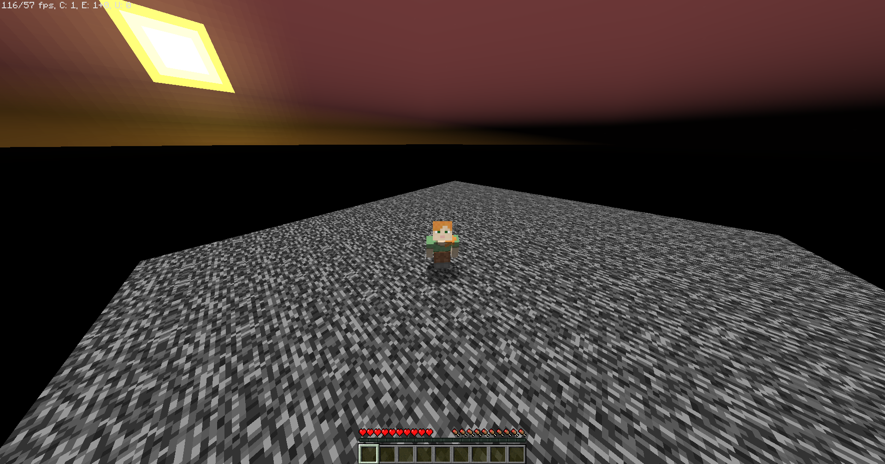

# Nylium

Open source Minecraft server written from scratch

## Motivation

I just want to get more comfortable with networking and with the Minecraft protocol. That is all.

## Plan

There is none. I don't know if this will ever be usable. I might just abandon this one day.

## Status

- Server list ping works (0x00 & 0x01)
- Login and encryption works
- Clients can join and walk around on a bedrock square

## Screenshots

Open me

<h4>First time a client has been able to join and walk around</h4>
</img>

